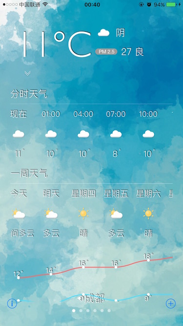

# SRClimate

### A simple style of weather forecasting project.

## Features

* Locate the current location of the device, display the current city weather information.
* You can also add common cities.

## Show Pictures

## 2016.11.09
> 第二版, 更改各视图关系, 重构代码.   
> Second Edition, change the view hierarchy, refactor the code.

## 2016.11.21
> 第一版, 很多地方待优化.   
> The first edition, many places to be optimized.

**If you have any question, please issue or contact me.**   
**If this repo helps you, please give it a star.**  
**Have Fun.**
